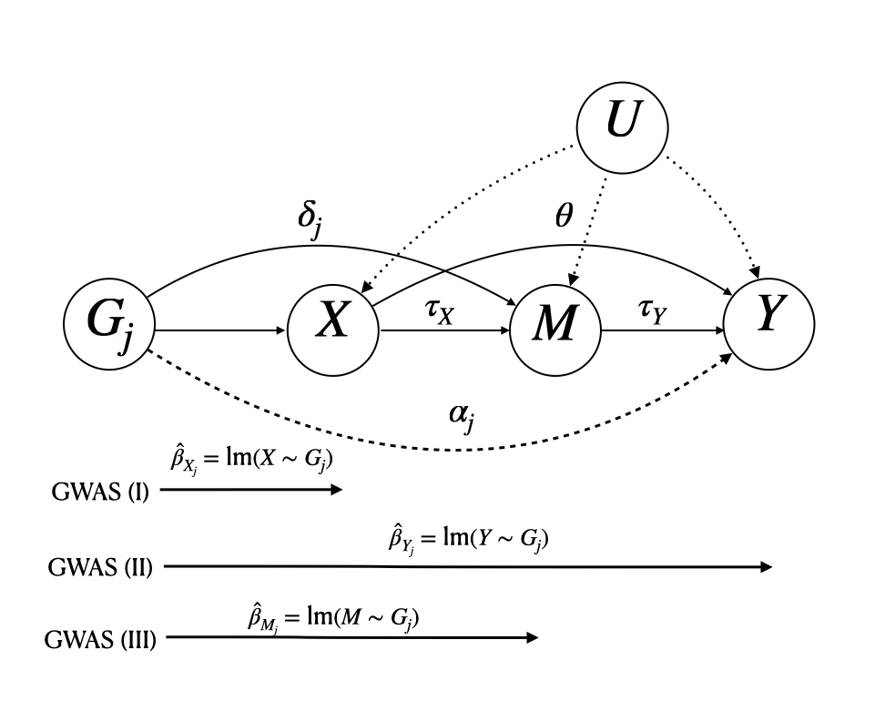

# MR.Rerand: Re-randomized Inverse-Variance Weighted Estimator in two-sample Mendelian Randomization with Summary-data and Mediation analysis in Mendelian Randomization with Summary-data


To install this package in R, run the following commands:


```R
library(devtools) 
install_github("LQRrrrr/MR.Rerand")
```

This package can implement (i) RIVW for estimating the causal effect $\beta$ from the exposure variable $X$ to the outcome variable $Y$, (ii)MAGIC for estimating the direct effects $\theta$ and $\tau_Y$, the mediation effect $\tau=\tau_X\tau_Y$, the causal effect $\tau_X$ from $X$ to $M$, and the total effect $\theta+\tau$ as parameters shown in the below figure.

Another important usage of this package is to generate the re-randomized effect size and the standard errors after Rao-Blackwellization for two-sample MR analysis to eliminate the winner's curse. The generated effect sizes and the standard errors can then be applied to two-sample MR methods with summary data.  Using notations in reference 1, Here, 

$$
\widehat{\gamma}_{j, \mathtt{RB}}=\widehat{\gamma}_{j}-\frac{\sigma_{X_j}}{\eta} 
$$


Here $\phi(\cdot)$, $\Phi(\cdot)$ denote the standard normal density and cumulative distribution functions.


<figure>
  
  <figcaption>Causal Diagram for Mediation Analysis.</figcaption>
</figure>


### References

- Ma, X., Wang, J., and Wu, C. (2023a). “Breaking the winner’s curse in Mendelian randomization: rerandomized inverse variance weighted estimator,” Annals of Statistics, 51 (1), 211–232.

- Lyu, R. Q., Wu, C., Ma, X., and Wang, J. (2023). Mediation Analysis with Mendelian Randomization and Efficient Multiple GWAS Integration. arXiv preprint arXiv:2312.10563.
